# Prctica-Tema-4-Installaci-i-Configuraci-de-Moodle

A aquesta practica he desenvolupat un portal Moodle amb una temàtica escollida lliurement, configurant-lo i explorant totes les opcions i eines des del punt de vista d'administrador.

## 1. Configuració de l'usuari:

Per poder configurar el teu usuari timdrem que anar a "**Área personal**" y domarli on tenim la nostra foto de perfil, hon tindrem que donarli a "**Perfil**".

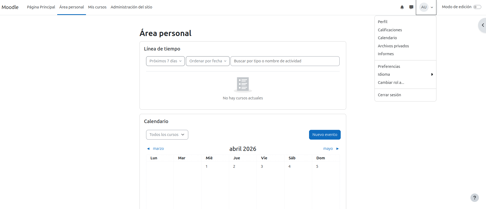

Aqui ens sortira informacio del nostre perfil, pero per poder congigura-lo tindrem que anar hon posa "**Editar perfil**".

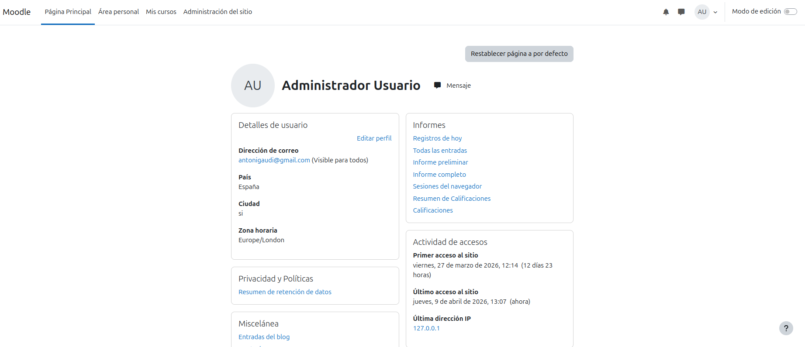

En aquest lloc podrem configurar algunes coses com son: el correu electronic, el nom que els surt als demas usuaris, contrasenyes... etc.

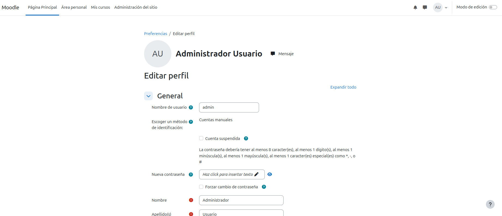

## 2. Configuració del lloc:

### 2.1 Configuració de la ubicació:

Per poder configurar l'ubicació tendrem que anar primerament desde el menu a "**Administració del lloc**"

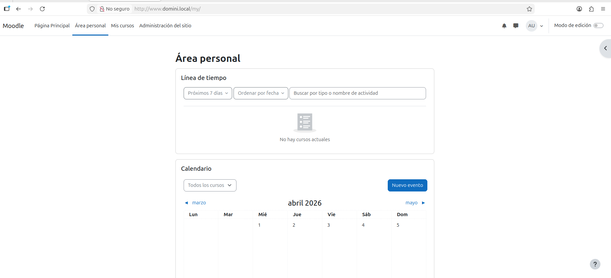

Després tindrem que buscar l'opció "**Ubicació**" i entrar allí.

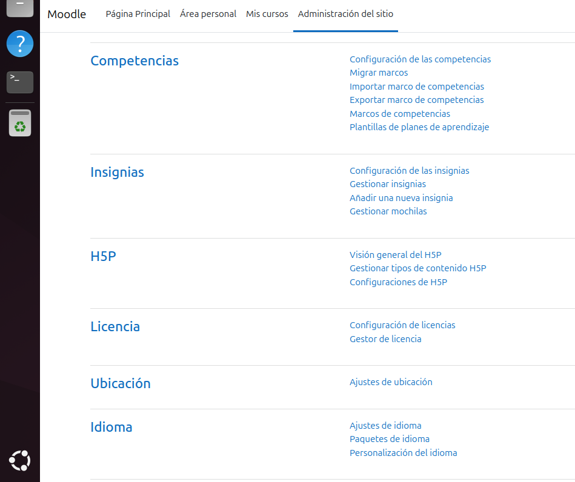

Y finalment, aqui tindrem que possar a nostra ubicacio per exepmle yo eh posat "Europa/Madrid" perque es el llloc que tinc mes cerca y tot lo demes lo eh posat perque l'usuaris el puguin configurar.

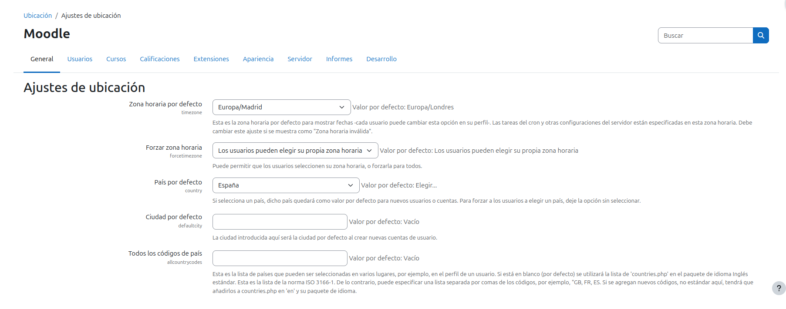

### 2.2 Configuració de l'idioma:

Per poder configurar l'idioma tendrem que anar primerament desde el menu a "**Administració del lloc**"

Després tindrem que buscar l'opció "**idioma**" i entrem hon posa "**Paquets d'idiome**".

Aqui podrem instalar els idiomes qu vulguem utilizar, per exemple yo eh instalat el angles.

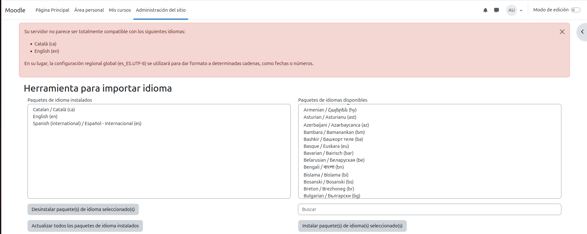

Despres tindrem que anar enrere y donarli a l'opció de "**ajustes d'idioma**"

Y finalment aqui podrem cambiar l'idioma hon possa "**idioma per defecte**"

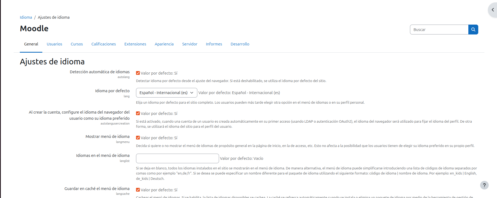

## 3. Creació d’un curs

En aquest apartat explicarem pas a pas com crear el teu primer curs a Moodle utilitzant les opcions d’administrador.

### 3.1 Accedir a la pàgina de cursos

Primerament, anirem al menú superior i seleccionarem **“Mis cursos”**.  
Aquí apareixerà una pantalla amb un missatge de benvinguda i l’opció **“Crear su primer curso”**.

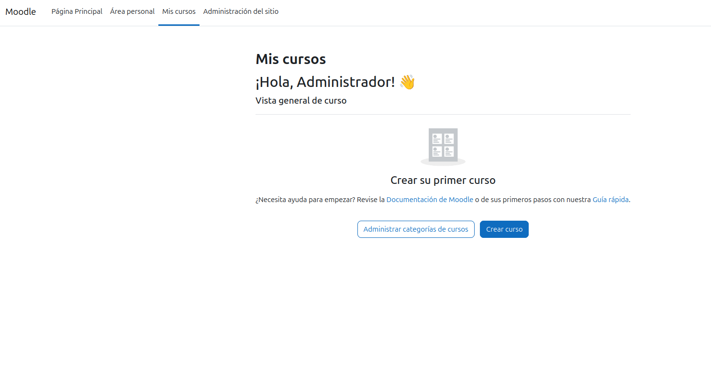

A continuació, premem el botó **“Crear curso”**.

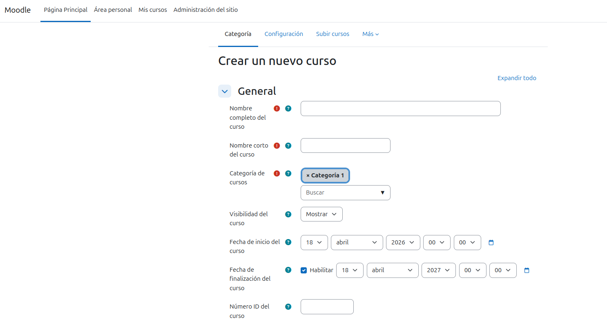

---

### 3.2 Formulari de creació del curs

Un cop dins de **“Crear un nuevo curso”**, veurem el formulari amb els paràmetres generals del curs.

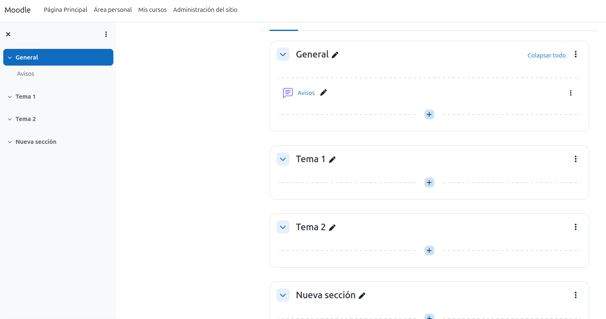

Els camps principals que hem d’omplir són:

#### • Nom complet del curs
Aquest és el títol que veuran els estudiants.  
Exemple: *“Introducción a Moodle”*.

#### • Nom curt del curs
Identificador breu del curs.  
Exemple: *“Moodle-Intro”*.

#### • Categoria del curs
Seleccionem la categoria on volem que estigui ubicat el curs, per exemple **“Categoría 1”**.

#### • Visibilitat del curs
Podem triar entre:
- **Mostrar** → el curs és visible per als estudiants.
- **Ocultar** → el curs queda amagat mentre el preparem.

---

### 3.3 Guardar el curs

Quan haguem completat tots els camps, baixem fins al final de la pàgina i fem clic a **“Guardar cambios”**.

A partir d’aquí, Moodle ens portarà automàticament a la pàgina principal del curs, on podrem començar a afegir seccions, activitats i recursos.

## 4. Afegir un arxiu al curs

Un cop tenim el curs creat i estructurat, podem començar a afegir contingut.  
En aquest exemple veurem com **afegir un arxiu** dins d’un tema del curs.

---

### 4.1 Accedir al tema on volem afegir l’arxiu

Primer, entrem al curs i seleccionem el tema on volem afegir el contingut, per exemple **“Tema 1”**.

A dins del tema, fem clic al botó **“+”** que apareix al centre de la secció.

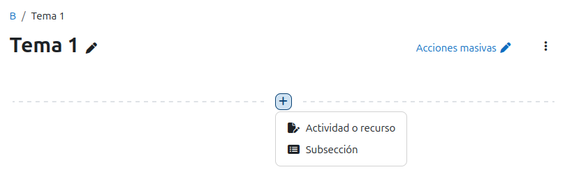

---

### 4.2 Seleccionar “Actividad o recurso”

En prémer el botó, apareixerà un menú amb dues opcions:

- **Actividad o recurso**
- **Subsección**

Seleccionem **“Actividad o recurso”**.

---

### 4.3 Triar el tipus de recurs “Archivo”

Apareixerà una finestra amb totes les activitats i recursos disponibles.  
Dins de la categoria **“Recursos”**, seleccionem **“Archivo”**.

Després fem clic al botó **“Añadir”**.

---

### 4.4 Configurar el recurs “Archivo”

Ara Moodle ens porta a la pantalla de configuració del recurs.

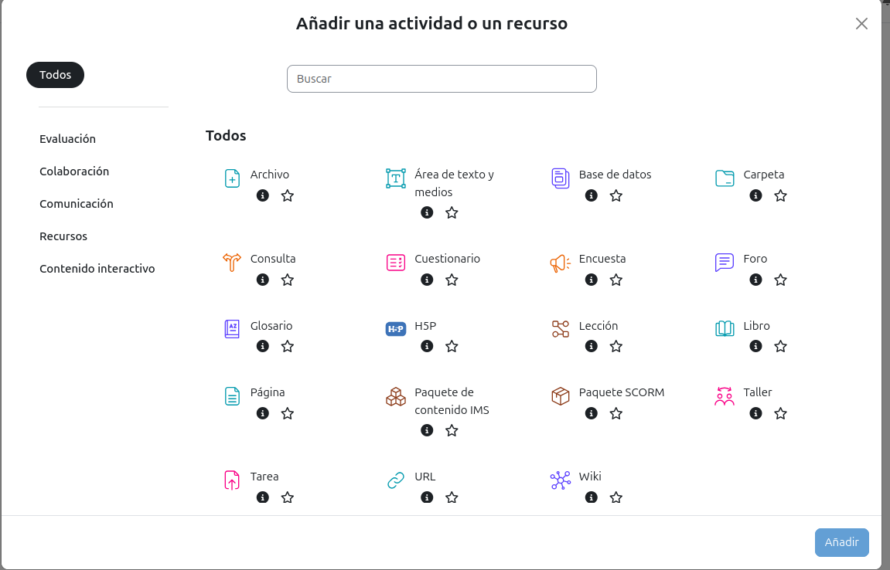

Els camps principals són:

#### • Nom
Nom que veuran els estudiants.  
Exemple: *“Imagen de ejemplo”*.

#### • Descripció
Opcional.  
Podem explicar què és l’arxiu o per a què serveix.

També podem marcar **“Mostrar la descripción en la página del curso”** si volem que aparegui visible.

---

### 4.5 Pujar l’arxiu

A l’apartat **“Seleccionar archivos”**, trobarem una zona on podem:

- Arrossegar i deixar anar un fitxer  
- O bé fer clic a la icona per seleccionar-lo manualment

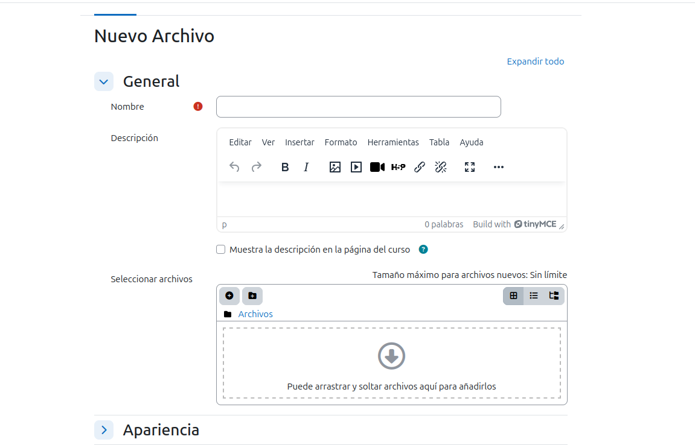

Moodle indica que la mida màxima és **sense límit**, així que podem pujar qualsevol tipus d’arxiu permès.

---

### 4.6 Guardar i veure el resultat

Quan haguem pujat el fitxer i configurat el recurs, baixem fins al final i fem clic a **“Guardar cambios”**.

A continuació, tornarem al tema i veurem l’arxiu afegit, per exemple:

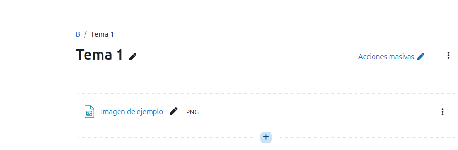

Ara els estudiants poden descarregar-lo o visualitzar-lo directament des del curs.

## 5 Crear usuaris

### 5.1 Crear usuaris manualment

Per poder crear un usuari nou tendrem que anar primerament desde el menu a "**Administració del lloc**" y anar a l'apartat "**d'usuaris**"

Després tindrem que buscar la seccio de "**Cuentas**" i entrem hon posa "**Crear un usuari nou**".

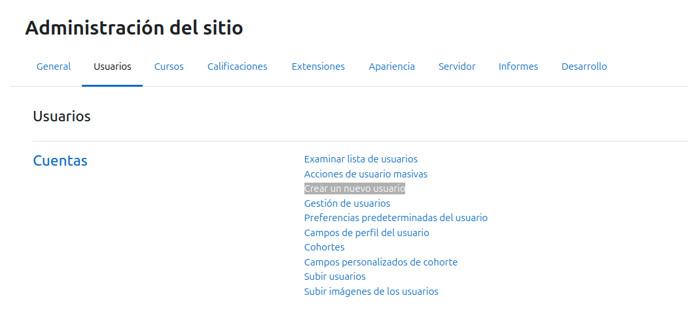

Cuan estiguem dintre, ens posara opcions hon podrem configurar: el nom d'usuari, el nom y cognoms de l'alumne/profesor, contraseña y la foto de perfil, les configurem y simplement baixarem a baix del tot y li donarem hon posa "**Crear nou usuari**".

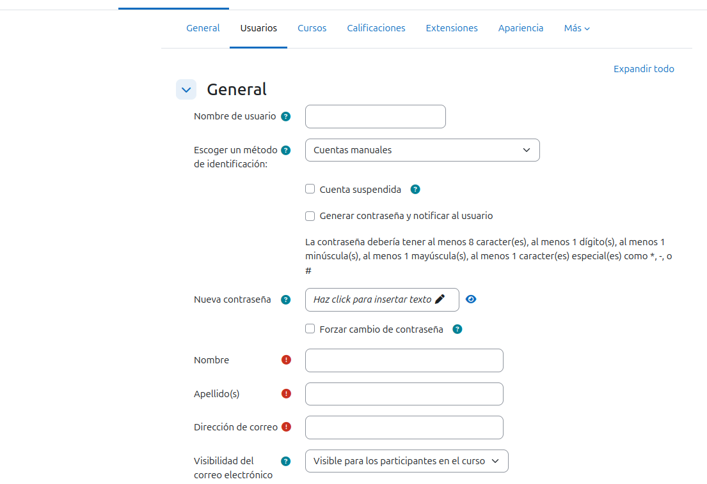

### 5.2 Crear usuaris automaticament

Per poder crear usaris nous tendrem que anar primerament desde el menu a "**Administració del lloc**" y anar a l'apartat "**d'usuaris**"

Després tindrem que buscar la seccio de "**Cuentas**" i entrem hon posa "**Subir usuaris**".

Cuan estiguem dintre, simplement tindrem que descarregar l'opció que es diu "**example.csv**", hon tindrem que configurar els noms, cognoms, gmail y contrasenya. Y per ultim tindrem que donar-li a "**subir usuaris**".

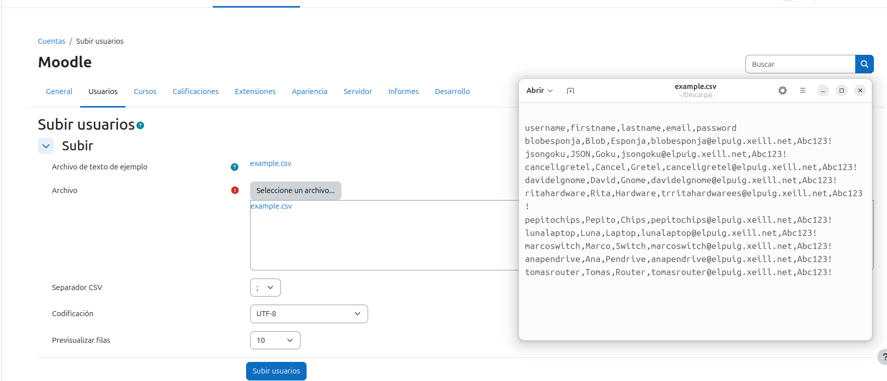

Y simplement anem a "**Previsualizar subida d'usuaris**" per comprobar que tot estigui bé y donar-li a "**Subir usuaris**" per guradar-lo.

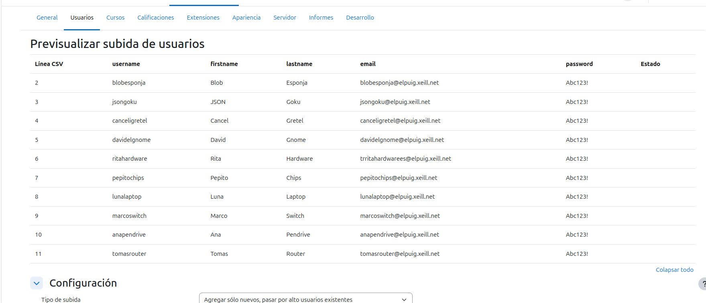

### 5.3 Borrar usuaris 

Per poder borrar usaris tendrem que anar primerament desde el menu a "**Administració del lloc**" y anar a l'apartat "**d'usuaris**"

Després tindrem que buscar la seccio de "**Cuentas**" i entrem hon posa "**Accions d'usuaris masives**".

Quan estiguem dintre simplement tindrem que seleccionar a un o mes usuaris y donar-li a boto hon posa "**Añadir a la selecció**", seguidament tindrem que anar a la secció de "**Amb els usuaris seleccionats**" i posarem l'opció de "**Borrar**" y finalment l'hi donarem a "**ir**" pero confirmar-lo.

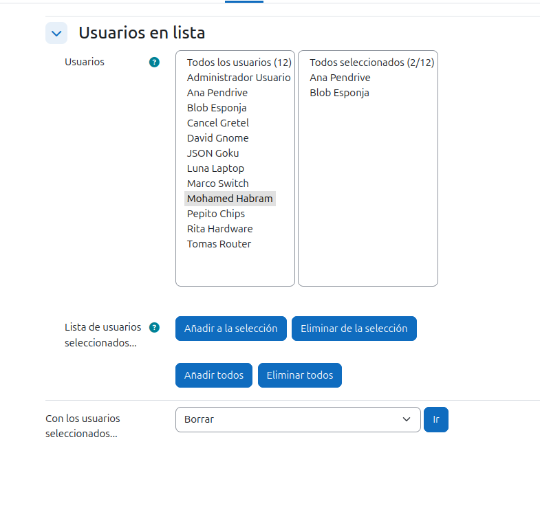

### 6 Posar en public/Privat un curs.

### 6.1 Posar en public un curs.

Per poder cambiar a public un curs tendrem que anar primerament desde el menu a "**Mis cursos**" 

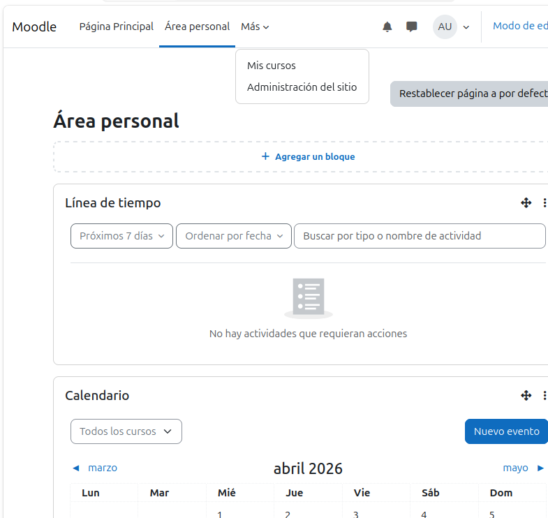

I anar al curs "**A**"

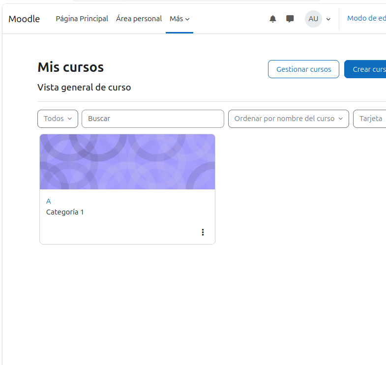

Quan estiguem dintre del curs, tindrem que anar a la secció "**Participants**", despres donar a "**Usuaris matriculats**" i finalment donarli a "**Métodos de matriculació**".

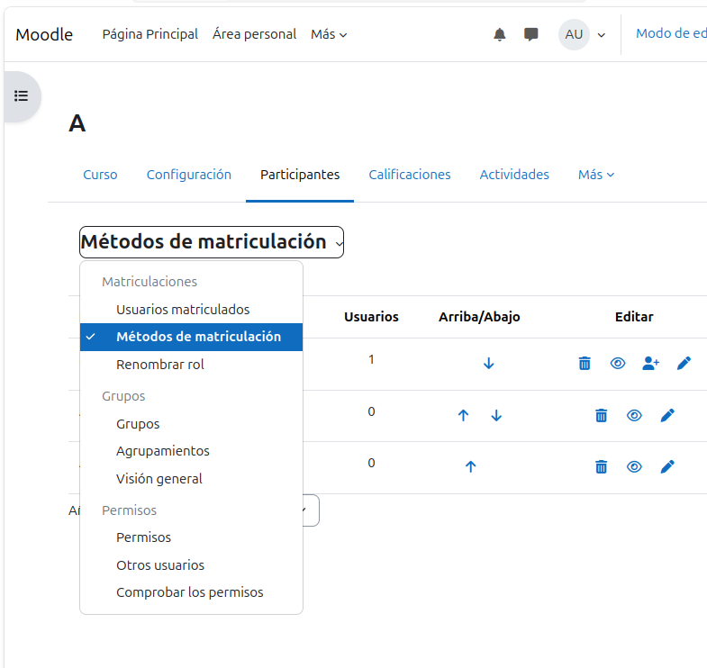

Y finalment, per posar-lo en public tindrem que posar tots els ulls oberts.

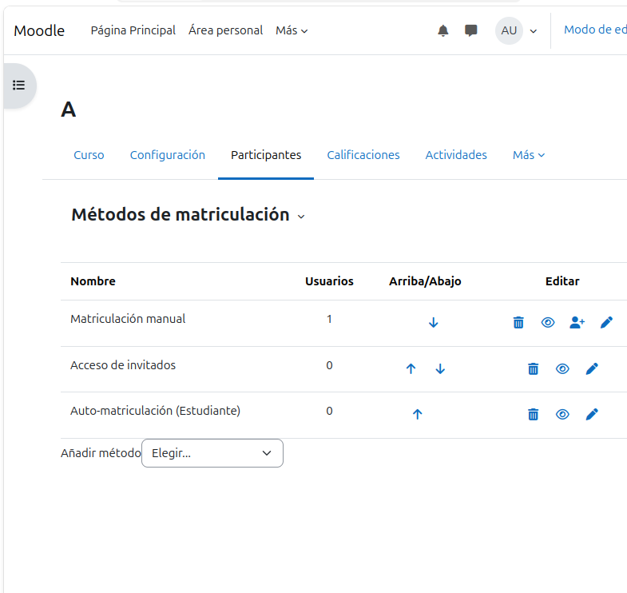

### 6.2 Posar en privat un curs.

Per poder cambiar a privat un curs tendrem que anar primerament desde el menu a "**Mis cursos**" 

I anar al curs "**B**"

Quan estiguem dintre del curs, tindrem que anar a la secció "**Participants**", despres donar a "**Usuaris matriculats**" i finalment donarli a "**Métodos de matriculació**".

Y finalment, per posar-lo en public tindrem que posar tots els ulls tancats menys el de "**Matriculación manual**".

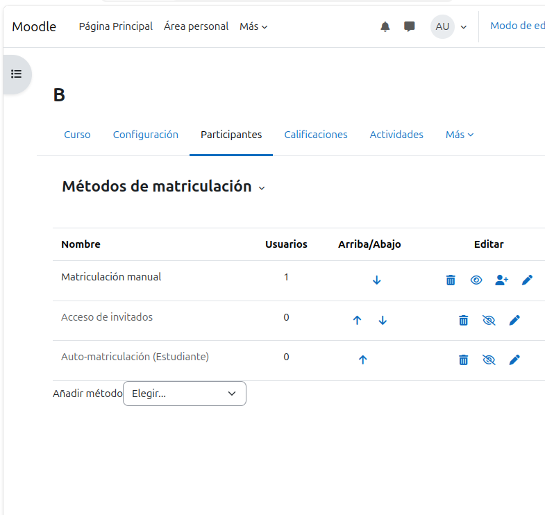

### 6.3 Verificació de que estiguin pribats o publics

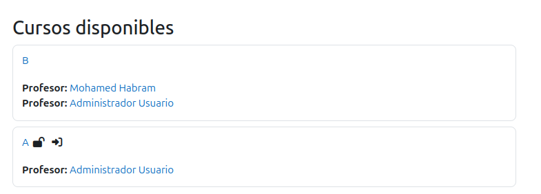

### 6.4 Com matricular a gent en un curs privat

Simplement tens que anar al curs d'onarli a "**participants**" y donar-li hon posa "**Matricular usuaris**", en aquesta finestra simplement tindrem que añadir als usuaris que volguem asignar-los com profesor o alumne y abaix hon possa "**assignar rol**" posar el rol de alumne o profesor y donar-li a "**Matricular usuaris**".

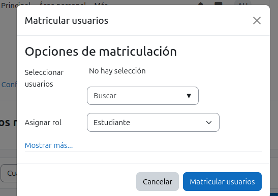

## 7 Personalitzar l'aspecte del lloc

### 7.1 Com cambiar el logotip

Per poder cambiar el logotip tendrem que anar primerament desde el menu a "**Administració del lloc**" y anar a l'apartat "**Aparencia**"

Després tindrem que buscar la seccio de "**Aparencia**" i entrem hon posa "**Logotips**".

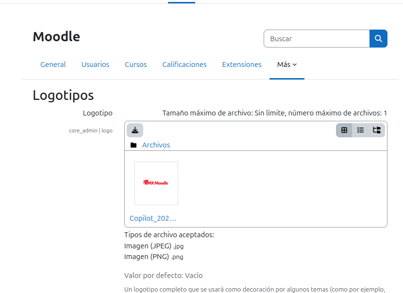

Simplement descarreguerem un png o jpg del logotip  que vulguenm i el pusarem a tots els apartats, y baixarem a abaix del tot hon possa "**Guardar cambis**".

### 7.2 Com cambiar el logotip

Per poder cambiar el Fons de pantalla tendrem que anar primerament desde el menu a "**Administració del lloc**" y anar a l'apartat "**Aparencia**".

Després tindrem que buscar la seccio de "**Aparencia**" i entrem hon posa "**Temas**" hon l'hi donarem a l'engranatge del nostre tema.

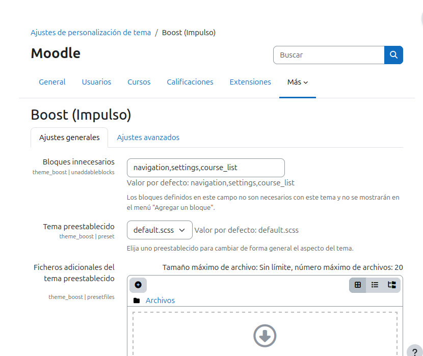

Simplement descarreguerem un png o jpg del Fondo de pantalla  que vulguenm i el pusarem al primer i ultim apartat, y baixarem a abaix del tot hon possa "**Guardar cambis**".

### 7.3 Resultat final:

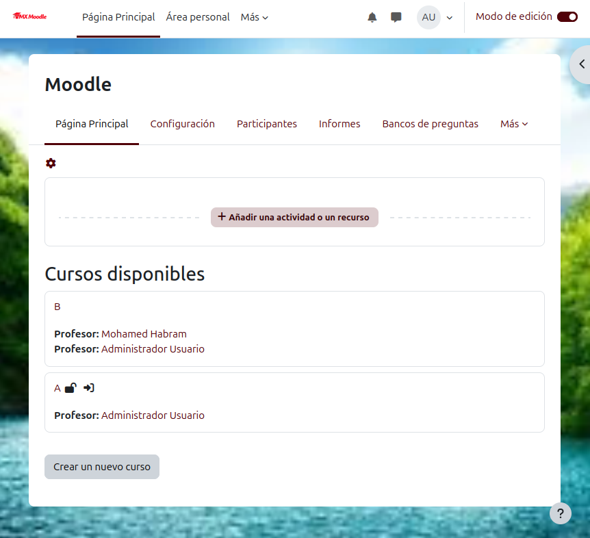

## 8 Com crear tasques:

### 8.1 Posar en public un curs.

Per poder crear una tasca nova, tendrem que anar primerament desde el menu principal a "**Mis cursos**" .

I anar al curs "**B**"

Seguidament, tindrem que anar a uns dels temas que em crat y tindrem que donar-li al simbol de "**+**"

Després tindrem que anar a la seccio de "**Evaluació**" i donar-li a l'opció "**tarea**".

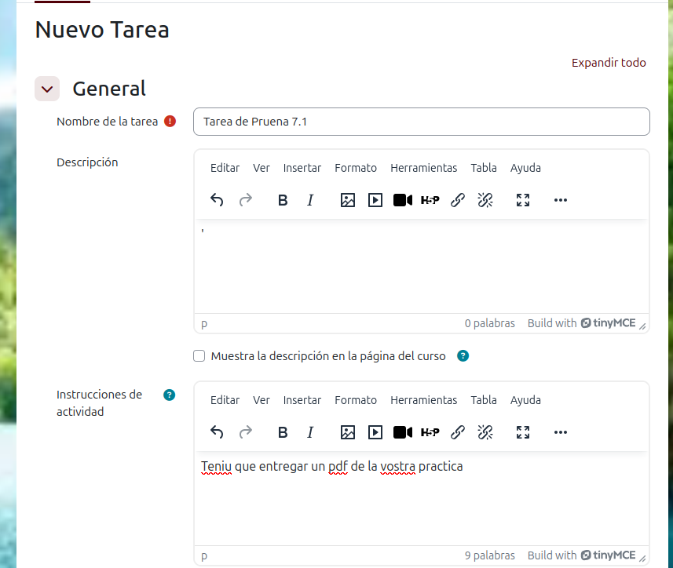

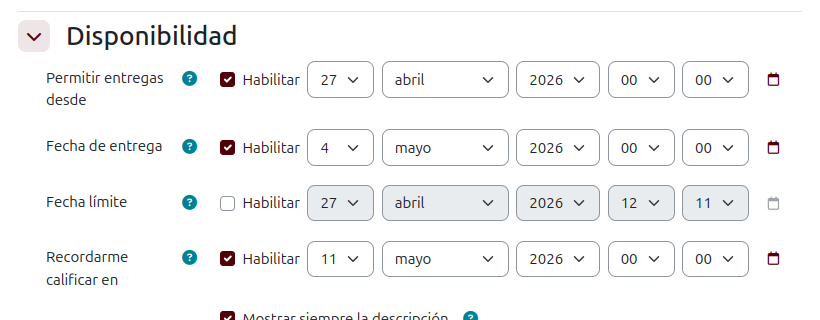

Ara simplement tindrem que editar-lo, posan el nom de la tasca, la fecha d'entrega, la descripció y les instrucciones.
Al cabar simplement tindrem que donar-li a "**Guardar**" que es troba abaix del tot.

### 8.1.1 Com es veu

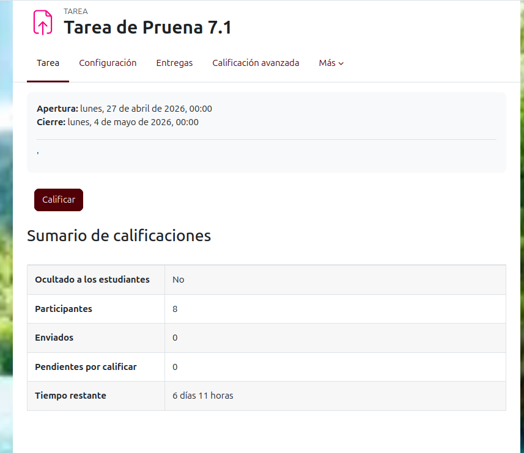

## 8.2 Com crear una copia de seguretat y utilitzar-la
Per poder crear una tasca nova, tendrem que anar primerament desde el menu principal a "**Mis cursos**" .

I anar al curs "**B**"

Despres tindrem que donar-li a la tasca que hem creat.

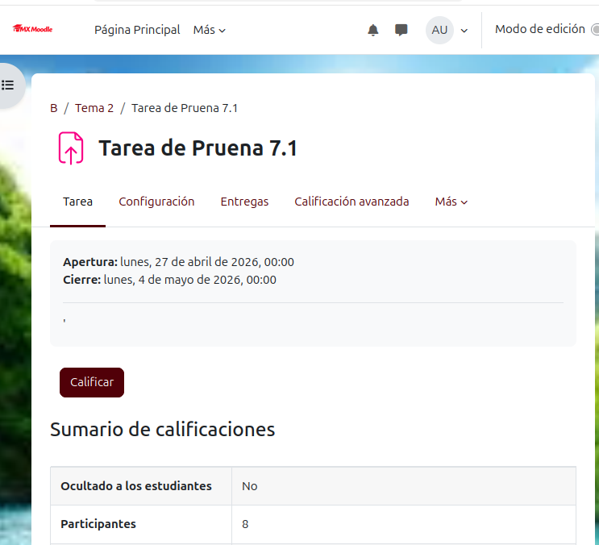

Despres tindrem que donar-li al "**Más**" i despres donar-li a l'opció de "**Copia de seguretat**".

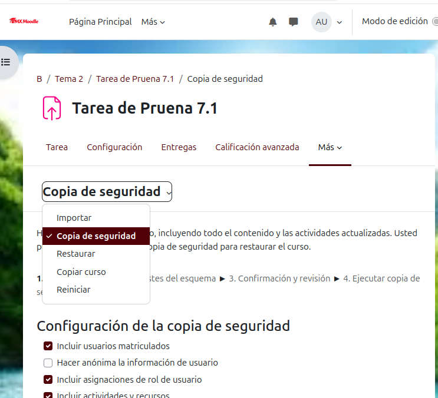

Despres tindrem que baixar i configurar el que vulguem añadir a la copia de seguretat, despresn al descargar la copia de seguretat, tindrem que anar al mateix lloc, pero tindrem que donar-li hon posa "**Copia de seguretat**" y donar-li a l'opció de "**Importar**"

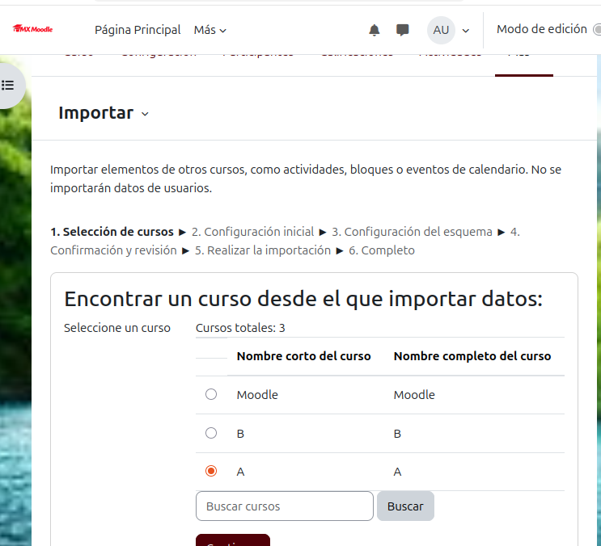

hon tindrem que seleccionar a quin curs posar l'informacio y despres posar-li el fitxher .zip o mbz que tinguem instalat.

## 8.3 Com importar una tasca ya feta

Per poder crear una tasca nova, tendrem que anar primerament desde el menu principal a "**Mis cursos**" .

I anar al curs que vulguem importar les tasques d'un altre.

Despres tindrem que donar-li a la tasca que hem creat.

Despres tindrem que donar-li al ""**Más**" y donar-li hon posa "**import**"
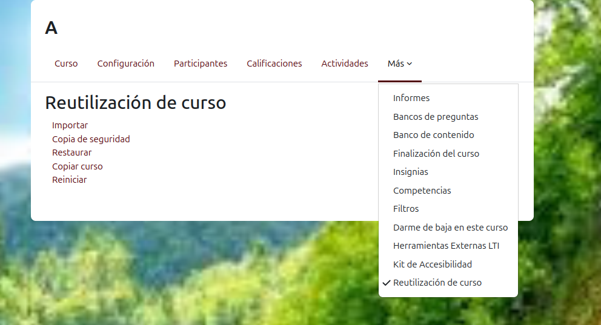

Per ultim tindrem que possar el curs del que vulguem sacar l'informació y despres anar a l'ultim pas hon tindrem que donar-li a "**retilització de cursos**" y despres donar-li a "**importació**", y ya tendriem tot del curs A al curs B.

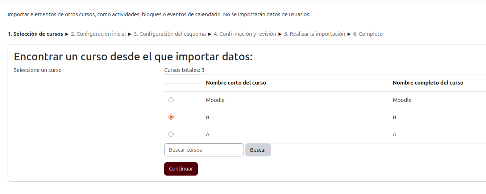

## 9 Com configurar les qualificacións automatiques y com crear insignes

### 9.1 Com configurar les qualificacións automatiques 

Per poder configurar la calificació, tendrem que anar primerament desde el menu principal a "**Mis cursos**" .

I anar al curs que vulguem configurar les calificacións.

Despres tindrem que donar-li a hon possa "**Calificacións**" y hon possa "**Informe de calificador**", l'hi donem y despres a l'opció de "**Configuració de calificacións**"

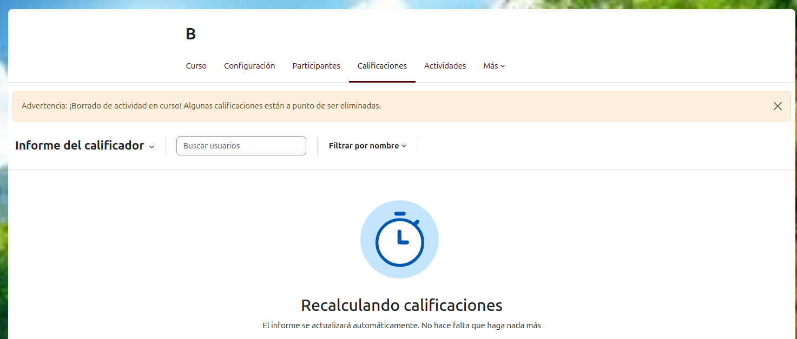

Ara, aqui podrem cambiar coses com els porcentatges que equivalen cada tasca per separat, com es fa la suma total... entre altres cosas.

Quan acabis de configurar-lo simplement tendras que anar abaix del tot y donar-li a "**Guardar cambios**"

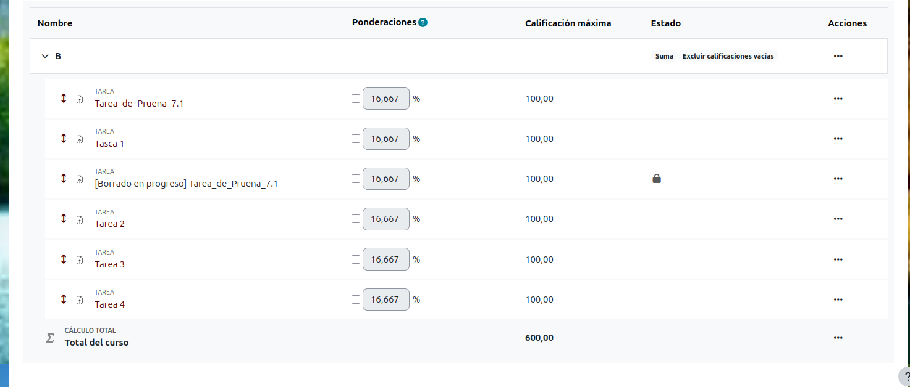

### 9.2 com crear insignes

Per poder crear usuaris tendrem que anar primerament desde el menu a "**Administració del lloc**".
Després tindrem que buscar la seccio "**d'insignies**" i entrem hon posa "**Crear nova insignia**".

Aqui podrem configurar tot de la insignia, com el nombre, la foto y altres coses, cuan ya hem acabat de configurar-lo, simplement l'hi donem a "**guardar**".

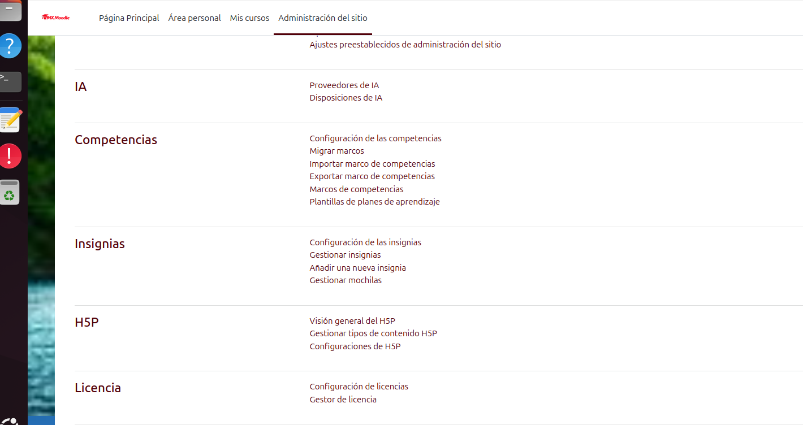

Ahora tendremos que darle a "**elegir**" i elegir que criterio queremos poner-le a nuestra insignia, yo le pondre el de "**Concesion manual por rol**" y se lo asignare a quienes tienen rol de professor.

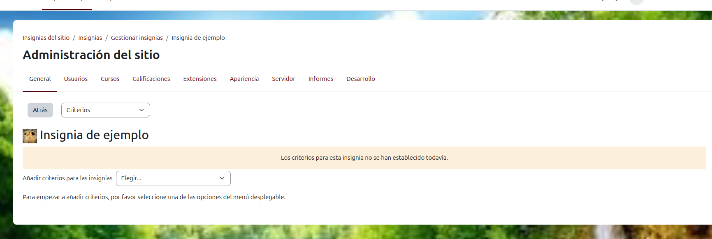

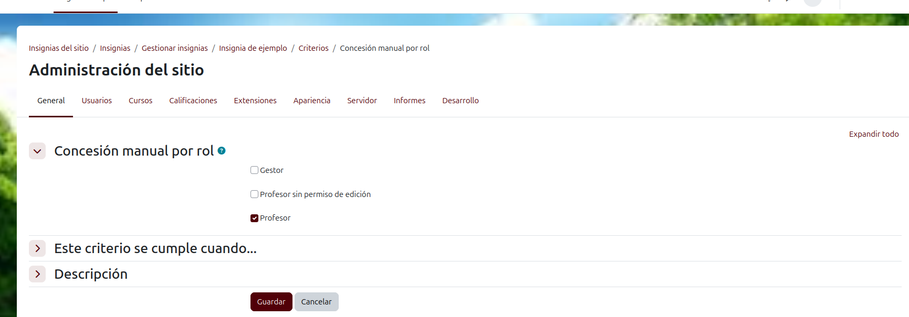

Al acabar tendremos que ir i darle a habilitar insignia para que se pueda utilizar.

#### 9.2.1 com assignar insignes

Per poder assignar una insignia a usuaris tendrem que anar primerament desde el menu a "**Administració del lloc**".
Després tindrem que buscar la seccio "**d'insignies**" i entrem hon posa "**Gestionar insignies**"

Aqui simplement tindrem que buscar la insignia que vulguem assignar, donar-li als "**tres puntets**" i simplement donar-li a "**otorgar insignia**"

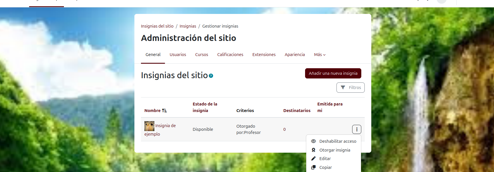

Simplement tindrem que fert click en el nombre de l'alumne que vulguem assignar-li l'insignia i donar-li a boto de "**otorgar insignia**" i ya estaria!

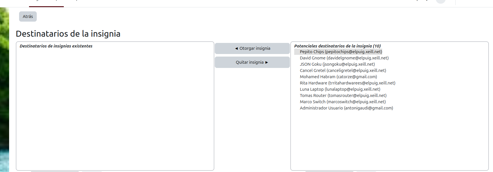

## 10 Com Bannegar una IP i com aplicar regles de seguretat

### 10.1 Com Bannegar una IP 

Per poder bannegar una IP, tendrem que anar primerament desde el menu a "**Administració del lloc**".
Després tindrem que buscar la secció de "**seguretat**" i entrem hon posa "**bloqueador d'IP**"

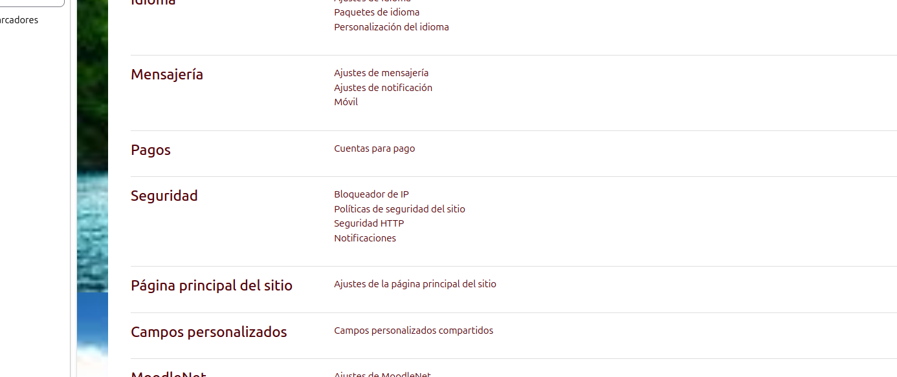

aqui tindrem que baixa i hon possa "**Llista d'IPs bloqueadas**" i posar l'IP que vullguem bloquear.

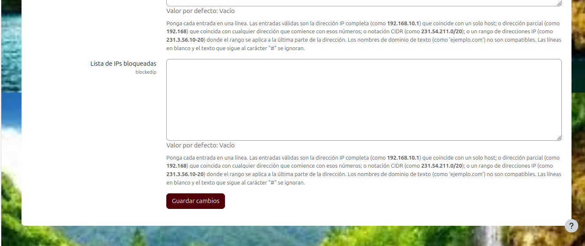

### 10.2 Com aplicar regles de seguretat

Per poder aplicar regles de seguretat, tendrem que anar primerament desde el menu a "**Administració del lloc**".
Després tindrem que buscar la secció de "**seguretat**" i entrem hon posa "**Politiques de seguretat del llocs**"

Aqui se pueden cambiar muchas cosas como son los: “**Umbral de bloqueo de la cuenta**”, “**Forzar a los usuarios a iniciar sesión**”, “**Permitir indexado por motores de búsqueda**”, “**Comprobar contraseña al iniciar sesión**”, “**Recordar nombre de usuario**”, “**Abrir a Google**”, “**Tamaño máximo del archivo subido**”, “**Espacio de archivos privados**”, “**Forzar login para ver avatares**” o otros...

Yo eh cambiado estos tres puntos por las siguientes razones:

“**Forzar a los usuarios a iniciar sesión**” a Sí, porque creo que es la forma más efectiva de evitar que personas externas vean cursos o información interna del sitio.

“**Umbral de bloqueo de la cuenta**” a un valor como 5 intentos, porque creo que es importante proteger el sitio contra ataques de fuerza bruta sin bloquear cuentas por error.

“**Comprobar contraseña al iniciar sesión**” a Sí, porque creo que así todos los usuarios, incluso los antiguos, cumplen la política de contraseñas actual.

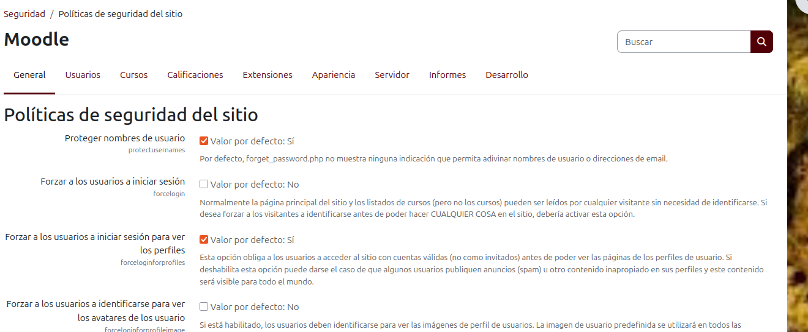
